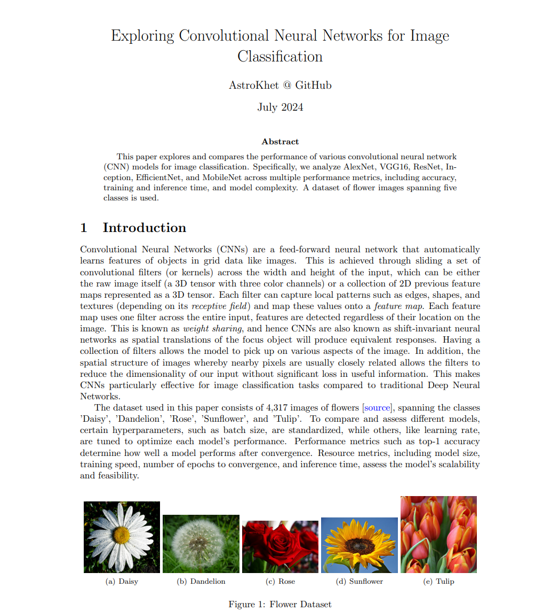
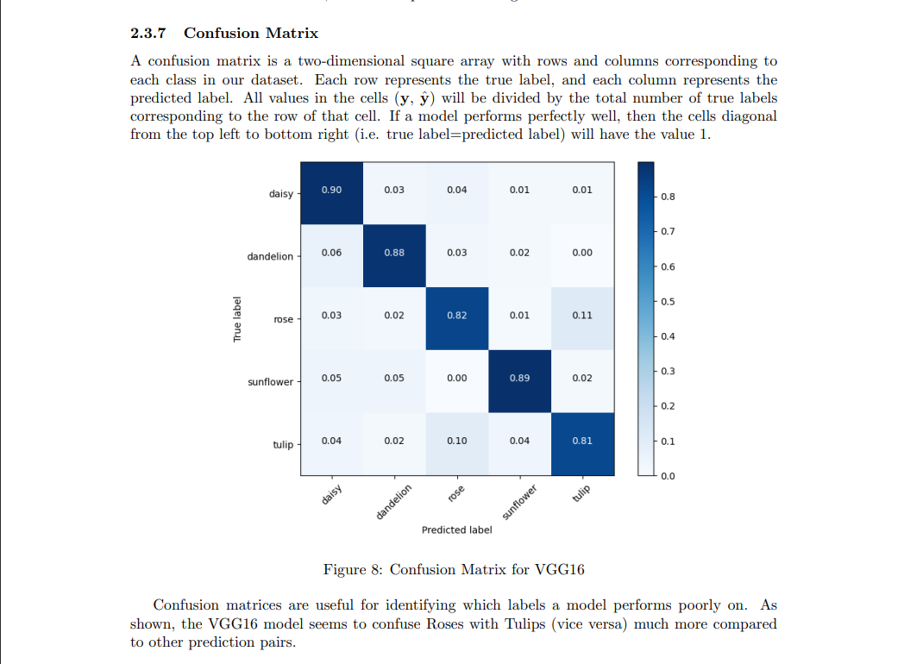
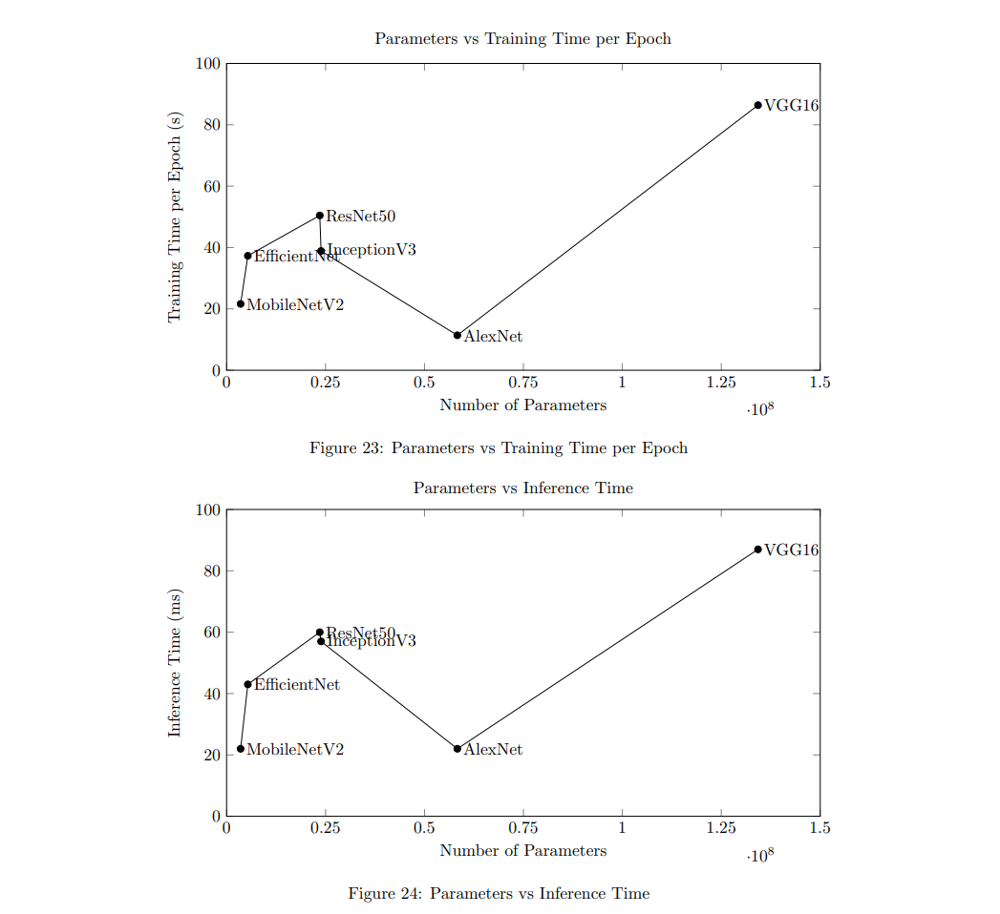

# Exploring Convolutional Neural Networks
## Abstract
This paper explores and compares the performance of various convolutional neural network (CNN) models for image classification. Specifically, we analyze AlexNet, VGG16, ResNet, Inception, EfficientNet, and MobileNet across multiple performance metrics, including accuracy, training and inference time, and model complexity. A dataset of flower images spanning five classes is used.

Do read the paper "Exploring_CNNs_for_Image_Classification.pdf" for the scope of this project.
## Paper Preview

### Abstract

### Confusion Matrix

### Results

